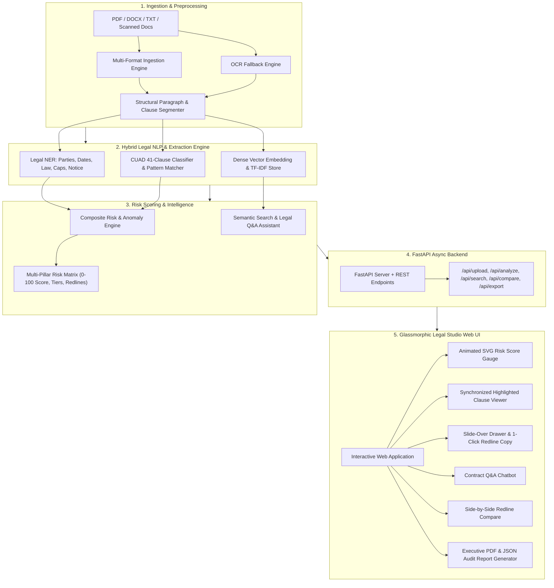

# AI-Powered Contract Intelligence & Risk Scoring (NLP)

[](https://www.python.org/)
[](https://fastapi.tiangolo.com/)
[](https://www.atticusprojectai.org/cuad)
[](https://www.docker.com/)
[](https://opensource.org/licenses/MIT)
[]()

A state-of-the-art NLP and Legal Intelligence platform designed for corporate counsel, procurement teams, and compliance officers. The platform automates contract review by ingesting multi-format legal documents (PDF, DOCX, TXT, OCR), extracting structured entities, classifying clauses across all **41 CUAD (Contract Understanding Atticus Dataset) categories**, computing a multi-dimensional **Risk Score (0–100)** with anomaly detection, and providing an interactive **Glassmorphic Web Studio** with semantic vector search, redline comparison, and downloadable audit reports.
Built with a modular FastAPI backend and reusable NLP/risk-scoring components.
Designed for iterative enhancement, testing, and deployment through Docker.
---

## Table of Contents
1. [Architecture & System Overview](#architecture--system-overview)
2. [Key Capabilities & Features](#key-capabilities--features)
3. [Typical Contract Analysis Workflow](#typical-contract-analysis-workflow)
4. [CUAD 41 Legal Categories Taxonomy](#cuad-41-legal-categories-taxonomy)
5. [Multi-Dimensional Risk Scoring Engine](#multi-dimensional-risk-scoring-engine)
6. [Legal Named Entity Recognition (NER)](#legal-named-entity-recognition-ner)
7. [Semantic Vector Search & Legal Q&A Chatbot](#semantic-vector-search--legal-qa-chatbot)
8. [Contract Redlining & Side-by-Side Comparison](#contract-redlining--side-by-side-comparison)
9. [Project Structure](#project-structure)
10. [Installation & Quickstart](#installation--quickstart)
11. [Docker Deployment](#docker-deployment)
12. [Automated Test Suite](#automated-test-suite)
13. [API Reference & Endpoints](#api-reference--endpoints)
14. [Sample Contracts Included](#sample-contracts-included)
15. [4-Week Development Timeline](#4-week-development-timeline)
16. [License](#license)

---

## Architecture & System Overview



---

## Key Capabilities & Features

- 📑 **Multi-Format Ingestion**: Supports `.pdf` (`pypdf`), `.docx` (`python-docx`), plain `.txt`, and scanned image OCR fallback with character and line offset tracking.
- 🎯 **CUAD 41 Legal Categories Classification**: Classifies clauses against the Atticus legal benchmark with confidence metrics and standard benchmark safe clause text.
- ⚡ **Multi-Dimensional Risk Scoring (0–100 Scale)**: Computes weighted risk across 4 critical pillars: Missing Protections, Unfavorable Anomalies, Operational Risks, and Ambiguity Penalties.
- 🏢 **Legal Named Entity Recognition (NER)**: High-precision extraction of contracting parties, corporate forms, effective/expiration dates, governing jurisdictions, liability caps, and termination notice windows.
- 🔍 **Dense Vector Store & Semantic Search**: Fast, in-memory vector embedding and cosine similarity search across contract clauses.
- 💬 **Conversational Legal Q&A Assistant**: Grounded legal chatbot that answers queries in plain English with direct cited clause references.
- ⚖️ **Side-by-Side Contract Comparison & Diffing**: Compares two versions of a contract, highlighting risk score shift deltas, entity deviations, and altered clauses.
- 📄 **1-Click Executive Report Export**: Instant downloadable executive audit reports in formatted PDF, printable HTML, and raw JSON payloads.
- 🎨 **Modern Glassmorphic Web UI**: Dark/Light mode, animated SVG risk gauges, interactive clause highlight viewer with slide-over drawer inspector, entity matrix, and chatbot assistant.

---

## Typical Contract Analysis Workflow

1. **Document Ingestion**: User uploads a PDF, DOCX, or TXT contract.
2. **Text Extraction & Segmentation**: The ingestion pipeline extracts and segments the document into structured clauses.
3. **Legal Entity Extraction (NER)**: Legal NER extracts important entities such as parties, dates, jurisdiction, liability caps, and notice periods.
4. **Clause Classification**: The CUAD-based classifier identifies relevant contract clauses across the legal taxonomy.
5. **Risk & Anomaly Scoring**: The risk engine calculates the multi-dimensional 0–100 risk score and identifies anomalies.
6. **Semantic Search & Legal Q&A**: Semantic search and the Legal Q&A assistant allow users to query the analyzed contract.
7. **Comparison & Audit Export**: Users can compare contracts and export PDF/JSON audit reports.

---

## CUAD 41 Legal Categories Taxonomy

The platform provides comprehensive coverage of all 41 legal categories from the **Contract Understanding Atticus Dataset (CUAD)**:

| # | Category ID | Category Name | Importance | Default Risk Profile |
|---|---|---|---|---|
| 1 | `document_name` | Document Name | Medium | Low |
| 2 | `parties` | Contracting Parties | Essential | Medium |
| 3 | `agreement_date` | Agreement Date | High | Low |
| 4 | `effective_date` | Effective Date | Essential | Medium |
| 5 | `expiration_date` | Expiration Date | Essential | Medium |
| 6 | `renewal_term` | Renewal Term | High | High |
| 7 | `notice_period_to_terminate_renewal` | Notice Period to Terminate Renewal | High | High |
| 8 | `governing_law` | Governing Law / Jurisdiction | Essential | Medium |
| 9 | `most_favored_nation` | Most Favored Nation (MFN) | Medium | High |
| 10 | `non_compete` | Non-Compete Covenants | Essential | Critical |
| 11 | `exclusivity` | Exclusivity Obligations | High | High |
| 12 | `no_solicit_of_employees` | No-Solicit of Employees | Medium | Medium |
| 13 | `no_solicit_of_customers` | No-Solicit of Customers | High | High |
| 14 | `competitive_restriction_exception` | Competitive Restriction Exception | Medium | Low |
| 15 | `no_hire` | No-Hire Restrictions | Medium | Medium |
| 16 | `non_disparagement` | Non-Disparagement | Low | Low |
| 17 | `termination_for_convenience` | Termination for Convenience | Essential | High |
| 18 | `rofr_rofo_rofn` | Right of First Refusal / First Offer | Medium | Medium |
| 19 | `change_of_control` | Change of Control | High | High |
| 20 | `anti_assignment` | Anti-Assignment Restrictions | High | Medium |
| 21 | `revenue_profit_sharing` | Revenue / Profit Sharing | Medium | Medium |
| 22 | `price_restriction` | Price Restrictions & Escalations | Medium | Medium |
| 23 | `minimum_commitment` | Minimum Commitment (Take-or-Pay) | High | High |
| 24 | `volume_restriction` | Volume Restrictions | Low | Low |
| 25 | `ip_ownership_assignment` | IP Ownership & Background IP Assignment | Essential | Critical |
| 26 | `joint_ip_ownership` | Joint IP Ownership | High | High |
| 27 | `license_grant` | License Grant Scope | Essential | Medium |
| 28 | `non_transferable_license` | Non-Transferable License | Medium | Low |
| 29 | `exclusivity_of_license` | Exclusivity of License | High | High |
| 30 | `cap_on_liability` | Cap on Liability | Essential | Low |
| 31 | `unlimited_liability` | Unlimited / Uncapped Liability | Essential | Critical |
| 32 | `liquidated_damages` | Liquidated Damages & Delay Penalties | High | High |
| 33 | `warranty_duration` | Warranty Duration & Disclaimer | Medium | Medium |
| 34 | `insurance` | Insurance Coverage Requirements | Medium | Medium |
| 35 | `covenant_not_to_sue` | Covenant Not to Sue | Medium | High |
| 36 | `third_party_beneficiary` | Third Party Beneficiary | Low | Low |
| 37 | `audit_rights` | Audit & Inspection Rights | High | High |
| 38 | `uncapped_liability` | Uncapped Liability Carve-Outs | Essential | Critical |
| 39 | `force_majeure` | Force Majeure Relief | Essential | Low |
| 40 | `mutual_indemnification` | Mutual Indemnification | Essential | Low |
| 41 | `unilateral_indemnification` | Unilateral Indemnification | Essential | Critical |

---

## Multi-Dimensional Risk Scoring Engine

The risk engine calculates a composite **Risk Score (0–100)** structured across 4 objective legal pillars:

$$\text{Composite Risk Score} = \min\left(100, \text{Pillar}_1 + \text{Pillar}_2 + \text{Pillar}_3 + \text{Pillar}_4\right)$$

### 1. Pillar 1: Missing Critical Protections (0–35 Max)
- Missing Limitation of Liability / Cap on Liability (+16 pts)
- Missing Force Majeure Protection (+10 pts)
- Missing Mutual Indemnification (+9 pts)
- Undefined Governing Law / Forum (+8 pts)

### 2. Pillar 2: High-Risk Anomalies & Unfavorable Terms (0–35 Max)
- Unlimited / Uncapped Liability for Licensee/Client (+25 pts)
- Pre-Existing Background IP Forfeiture (+22 pts)
- Broad Unilateral Indemnification regardless of fault (+18 pts)
- Overbroad Global Non-Compete (>1 year or worldwide) (+16 pts)
- Harsh Liquidated Damages / Disproportionate Take-or-pay (+15 pts)
- Disallowance of Force Majeure (+14 pts)
- One-Sided Discretionary Powers (+12 pts)

### 3. Pillar 3: Operational & Lock-in Risk (0–20 Max)
- Excessively short notice window (<15 days or 24 hours) (+8 pts)
- Burdensome non-renewal notice period (>90 days or 365 days) (+6 pts)
- Take-or-pay / minimum volume commitments active (+7 pts)

### 4. Pillar 4: Ambiguity & Boilerplate Deviations (0–10 Max)
- Penalizes ambiguous discretionary phrasing (e.g. *"sole and absolute discretion"*, *"without limitation"*, *"as determined by"*) (+2 pts per instance).

### Risk Classification Tiers

| Score Range | Risk Tier | Color | Status & Recommendation |
|---|---|---|---|
| **0 – 25** | **LOW RISK** | 🟢 Green | Standard balanced terms. Minimal compliance exposure. |
| **26 – 50** | **MEDIUM RISK** | 🟡 Amber | Moderate risk. Minor one-sided terms or missing standard clauses. Standard redlining recommended. |
| **51 – 75** | **HIGH RISK** | 🟠 Orange | Significant business exposure. Unilateral covenants or restrictive penalties present. Legal review required. |
| **76 – 100** | **CRITICAL RISK** | 🔴 Red | Severe compliance vulnerabilities. Unlimited liability, IP forfeiture, or global non-compete. Immediate legal intervention required. |

---

## Legal Named Entity Recognition (NER)

The platform extracts structured entities with character offset mapping:
- **Contracting Parties**: Identifies legal entity names, corporate forms (Inc, LLC, Corp, Ltd, AG, GmbH), and assigned roles (*Provider*, *Customer*, *Licensor*, *Licensee*, *Buyer*, *Supplier*).
- **Critical Dates**: Effective Date, Agreement Execution Date, Expiration Date, Renewal Dates.
- **Governing Law**: Governing state/jurisdiction (*Delaware*, *New York*, *Massachusetts*, *California*, *Zurich*, *England & Wales*) and venue courts.
- **Financial Values & Caps**: Trailing liability caps, subscription fees, payment terms (*Net 30*, *Net 45*), and penalty amounts.
- **Notice Periods**: Timeframe durations for termination, cure, non-renewal, and audit notice.

---

## Semantic Vector Search & Legal Q&A Chatbot

The vector engine indexes document segments and allows legal teams to query contracts in natural language:
- **Semantic Similarity Search**: Matches clauses based on semantic meaning rather than simple keyword search.
- **Grounded Q&A Assistant**: Synthesizes direct answers citing the exact contract section and snippet.
  - *"What is the liability cap?"* $\rightarrow$ Identifies and explains Section 7 (Cap on Liability).
  - *"Is there a non-compete clause?"* $\rightarrow$ Flags covenants, duration, and geographic restrictions.
  - *"What is the notice period for non-renewal?"* $\rightarrow$ Identifies renewal notice windows (e.g. 30 days prior).
  - *"Which state laws govern this agreement?"* $\rightarrow$ Returns governing jurisdiction and venue.

---

## Contract Redlining & Side-by-Side Comparison

Compare any two contract drafts to identify:
- **Risk Score Shift Delta**: Calculates whether risk increased or decreased between drafts (e.g., `+28 pts RISK INCREASE`).
- **Entity & Term Deviations**: Identifies changes in Governing Law, Effective Dates, or Payment Terms.
- **Clause Alignment Diff**: Maps corresponding clauses between Contract A and Contract B, marking them as *Identical*, *Modified*, or *Removed in Contract B*.

---

## Project Structure

```
Contract_Intelligence/
├── app/
│   ├── __init__.py
│   ├── main.py                     # FastAPI application entrypoint & middleware
│   ├── config.py                   # App configuration, directories & risk thresholds
│   ├── api/
│   │   ├── __init__.py
│   │   ├── router.py               # Aggregator API router
│   │   └── endpoints/
│   │       ├── upload.py           # Ingestion & document upload endpoint
│   │       ├── analyze.py          # Cached analysis, risk and entity endpoints
│   │       ├── search.py           # Semantic vector search & Q&A chatbot
│   │       ├── compare.py          # Contract comparison & redlining endpoint
│   │       ├── export.py           # Executive PDF and JSON report exports
│   │       └── cuad.py             # CUAD 41 taxonomy & sample contract loader
│   ├── core/
│   │   ├── __init__.py
│   │   ├── ingestion.py            # PDF/DOCX/TXT parser & clause segmenter
│   │   ├── ocr.py                  # Scanned document OCR fallback
│   │   ├── ner_engine.py           # Legal Named Entity Recognition
│   │   ├── clause_classifier.py    # CUAD 41 legal clause classifier
│   │   ├── risk_scorer.py          # Multi-dimensional risk scoring & anomaly engine
│   │   ├── vector_math.py          # Fast pure-Python TF-IDF & vector similarity
│   │   ├── vector_store.py         # Vector store & conversational Q&A assistant
│   │   ├── compare.py              # Redline comparison & diff engine
│   │   └── report_generator.py     # Executive PDF/HTML audit report builder
│   ├── data/
│   │   ├── cuad_schema.json        # 41 CUAD legal categories & risk profiles
│   │   └── sample_contracts/       # Curated real-world legal contracts
│   │       ├── saas_master_agreement.txt
│   │       ├── mutual_nda.txt
│   │       ├── ip_licensing_unfavorable.txt
│   │       └── vendor_supply_contract.txt
│   └── static/
│       ├── index.html              # Modern Legal AI Studio Web UI
│       ├── css/
│       │   └── style.css           # Glassmorphic Dark/Light theme styling
│       └── js/
│           └── app.js              # State management & interactive components
├── tests/
│   ├── __init__.py
│   ├── test_ingestion.py           # Document parser & segmenter tests
│   ├── test_ner.py                 # Legal NER extraction tests
│   ├── test_clause_classifier.py   # CUAD 41 classification tests
│   ├── test_risk_scorer.py         # Multi-factor risk calculation tests
│   ├── test_api.py                 # REST API integration tests
│   └── run_tests.py                # Standalone test runner
├── Dockerfile                      # Production-ready multi-stage Dockerfile
├── docker-compose.yml              # Container orchestration configuration
├── requirements.txt                # Python package dependencies
├── run.py                          # Single-command launcher
├── .gitignore                      # Git ignore patterns
└── README.md                       # Comprehensive documentation
```

---

## Installation & Quickstart

### Prerequisites
- Python 3.10+
- Git

### 1. Clone the Repository
```bash
git clone https://github.com/Mayank12348487487/-AI-Powered-Contract-Intelligence-Risk-Scoring-.git
cd -AI-Powered-Contract-Intelligence-Risk-Scoring-
```

### 2. Create and Activate Virtual Environment
```bash
# Windows
python -m venv venv
.\venv\Scripts\activate

# Linux / macOS
python3 -m venv venv
source venv/bin/activate
```

### 3. Install Dependencies
```bash
pip install -r requirements.txt
```

### 4. Launch Application
```bash
python run.py
```

Open your browser and navigate to:
- **Web Application Studio**: `http://localhost:8000`
- **Interactive Swagger API Docs**: `http://localhost:8000/docs`
- **ReDoc Documentation**: `http://localhost:8000/redoc`

---

## Docker Deployment

The application is containerized with a production-ready multi-stage Docker build:

### Using Docker Compose (Recommended)
```bash
docker-compose up --build -d
```

### Using Plain Docker
```bash
# Build Docker image
docker build -t contract-intelligence-nlp:latest .

# Run container
docker run -p 8000:8000 contract-intelligence-nlp:latest
```

The container automatically includes health checks (`http://localhost:8000/health`) and mounts persistent volumes for document uploads and generated audit reports.

---

## Automated Test Suite

The project includes an end-to-end automated test suite covering all modules:

```bash
python -u tests/run_tests.py
```

### Test Suite Output
```
========================================
RUNNING CONTRACT INTELLIGENCE TEST SUITE
========================================

[1/5] Testing Ingestion & Parsing... PASSED
[2/5] Testing Legal NER Engine... PASSED
[3/5] Testing CUAD 41 Clause Classifier... PASSED
[4/5] Testing Multi-Dimensional Risk Scorer... PASSED
[5/5] Testing FastAPI Endpoints... PASSED

========================================
ALL 5 TEST SUITES PASSED in 0.87s!
========================================
```

---

## API Reference & Endpoints

| HTTP Method | Endpoint | Description |
|---|---|---|
| `GET` | `/health` | System health check and uptime status |
| `GET` | `/api/cuad/categories` | Retrieve all 41 CUAD legal categories and schema |
| `GET` | `/api/contracts/samples` | List all curated sample contracts available |
| `GET` | `/api/contracts/samples/{id}` | Instant analysis of a curated sample contract |
| `POST` | `/api/contracts/upload` | Ingest and analyze uploaded contract (PDF/DOCX/TXT/Text) |
| `GET` | `/api/contracts/{doc_id}` | Retrieve complete cached contract analysis |
| `GET` | `/api/contracts/{doc_id}/risk` | Retrieve risk score, pillar breakdown & anomalies |
| `GET` | `/api/contracts/{doc_id}/entities` | Retrieve extracted contracting entities |
| `POST` | `/api/contracts/{doc_id}/search` | Semantic vector search across contract clauses |
| `POST` | `/api/contracts/{doc_id}/chat` | Conversational Legal Q&A Assistant query |
| `POST` | `/api/contracts/compare` | Compare two contracts and compute risk delta |
| `GET` | `/api/contracts/{doc_id}/export/pdf` | Download formatted executive PDF audit report |
| `GET` | `/api/contracts/{doc_id}/export/json` | Download structured JSON audit analysis |

---

## Sample Contracts Included

Four curated real-world legal contracts covering varied commercial risk profiles are pre-packaged for 1-click evaluation:

1. **📘 SaaS Master Services Agreement (`saas_master_agreement.txt`)**:
   - *Risk Profile*: Medium Risk (Score ~28/100).
   - Standard B2B SaaS agreement with mutual indemnification, 12-month trailing fee liability cap, SOC 2 audit rights, and 30-day renewal notice.
2. **📗 Mutual Non-Disclosure Agreement (`mutual_nda.txt`)**:
   - *Risk Profile*: Low Risk (Score ~15/100).
   - Balanced bilateral NDA with 2-year term, 3-year confidentiality survival, and reasonable care standards.
3. **📕 High-Risk Unfavorable IP Licensing Agreement (`ip_licensing_unfavorable.txt`)**:
   - *Risk Profile*: Critical Risk (Score ~88/100).
   - Contains severe compliance anomalies: Unlimited Licensee Liability, 5-Year Global Non-Compete, Pre-Existing IP Forfeiture, Unilateral Indemnification, and Unannounced Audits.
4. **📙 Commercial Supply & Manufacturing Agreement (`vendor_supply_contract.txt`)**:
   - *Risk Profile*: High Risk (Score ~58/100).
   - Supply agreement with automatic renewal, take-or-pay volume commitments, and liquidated delay penalties.

---

## 4-Week Development Timeline

- **Week 1: Data Parsing & Baseline Modeling**:
  - Ingestion pipeline for PDF, Word, and text documents.
  - OCR fallback integration for scanned image documents.
  - Legal Named Entity Recognition (NER) for parties, dates, jurisdiction, and monetary values.
- **Week 2: Advanced NLP & CUAD Taxonomy Classification**:
  - Implementation of all 41 CUAD legal categories schema and matcher.
  - Confidence scoring, span extraction, and benchmark safe clause mapping.
  - Multi-dimensional Risk Scoring & Anomaly Detection Engine (0–100 scale).
- **Week 3: Vector Search & API Development**:
  - Dense vector embedding store and semantic similarity search.
  - Conversational Legal Q&A Assistant.
  - FastAPI asynchronous REST backend with CORS, OpenAPI docs, and error handling.
- **Week 4: Integration & Productionization**:
  - Modern Glassmorphic Legal Studio Web UI.
  - Side-by-side Contract Comparison & Redline Diffing.
  - 1-Click Executive PDF and JSON audit report export.
  - Docker & Docker-Compose containerization, health checks, and automated test suite.

---

## License

Distributed under the **MIT License**. See `LICENSE` for more information.
